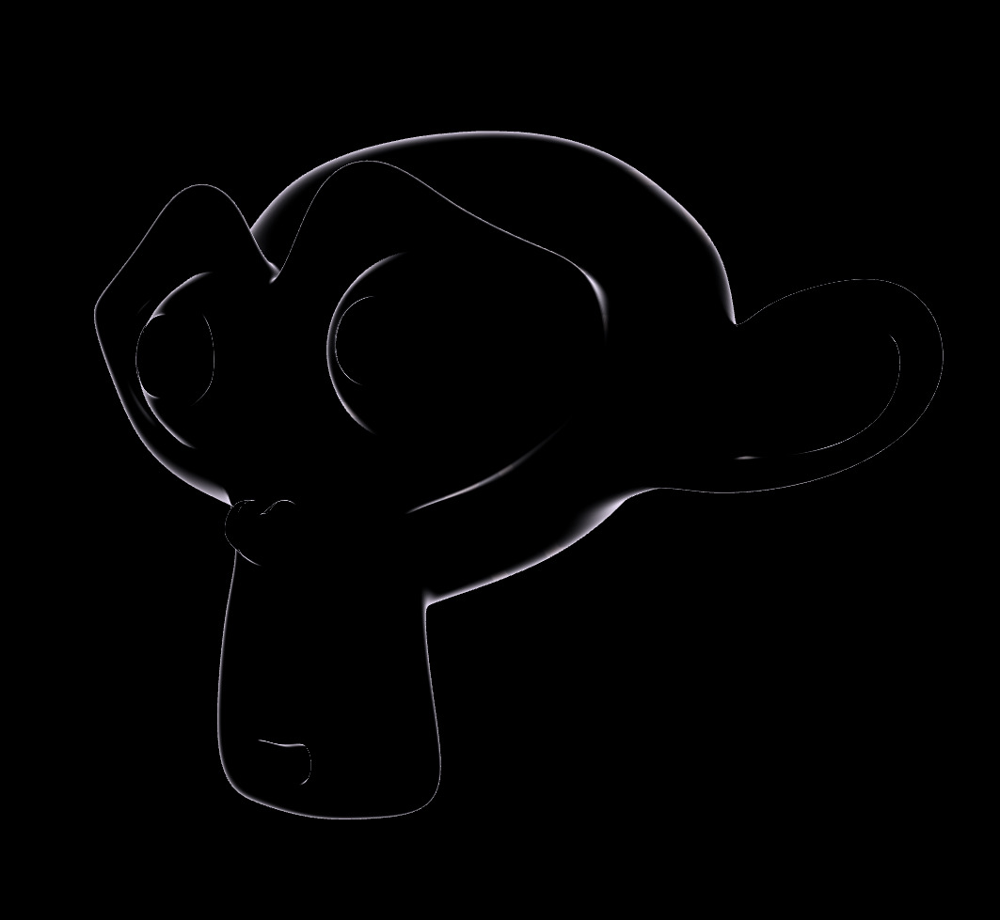
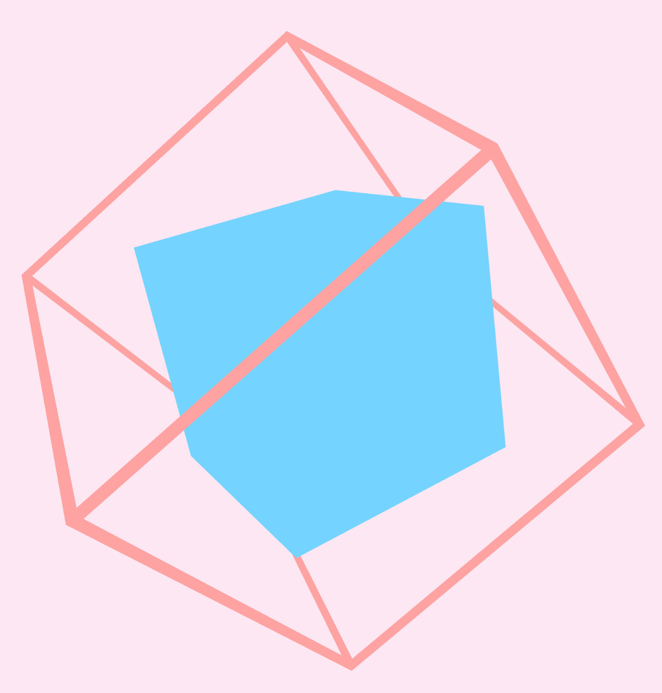

# 3D

The support for 3D is less fleshed out than for 2D at the moment, but it is
being worked on.

The workflow for 3D is different to 2D, as it would be too inefficient to
rebuild 3D meshes every frame, so they are retained. You can create a 3D mesh
from a .obj file. Instead of using a set flat/textured/patterned material like
in 2D, you can use any shader/material you want on 3D objects. There are built-in
functions for creating generic flat/physically shaded materials of different
colors, or you can create your own.

```rust
let program = include_program!(
    "./material_shader/outline_vertex.glsl",
    "./material_shader/outline_fragment.glsl"
)?;

let material = Material::new(program)
    .with_color("outline_color", Color::PURPLE_100)
    .with_float("outline_width", 0.3)
    .create();

let object = Object3D::from_obj_bytes_with_material(
    include_bytes!("../assets/models/suzanne.obj"),
    material,
)?;
```

Objects then need to be drawn every frame with `object.draw()`.



See: [3D module documentation](https://docs.rs/sge/latest/sge/prelude/d3/index.html)

## Materials

A material is just a collection of a vertex shader, fragment shader, and named
uniforms. Uniforms can be set using `material.set_*`, and can be used to pass
data from the CPU into the shader.

```rust
let threshold = (time * 0.2).sin() * 0.5 + 0.5;
mat.set_float("dissolve_threshold", threshold);
```

```c
#version 150

in vec3 v_normal;
in vec3 v_position;
in vec2 v_tex_coords;
in vec3 v_world_position;

out vec4 color;

uniform float time;
uniform float dissolve_threshold; // used here
```

There are some uniforms that are set automatically by the engine, and are
availible in all material shaders:

- `view_proj_matrix` mat4
- `model_matrix` mat4
- `normal_matrix` mat3
- `time` in seconds, float
- `delta_time` in seconds, float
- `random` number to use as a seed, float
- `screen_size` in pixels, vec2
- `camera_pos` vec3

See: [`Material` documentation](https://docs.rs/sge/latest/sge/prelude/rendering/struct.Material.html)

See: [`/examples/material.rs`](https://github.com/LilyRL/sge/blob/master/examples/material.rs)

See: [`/examples/material_shader/vertex.glsl`](https://github.com/LilyRL/sge/blob/master/examples/material_shader/vertex.glsl)

See: [`/examples/material_shader/fragment.glsl`](https://github.com/LilyRL/sge/blob/master/examples/material_shader/fragment.glsl)

## Shapes

In addition to loading shapes from an object, there are also functions for
creating simple shapes from some parameters. So far there are only:

- `cubiod`/`cube` (also `_from_extents` and `_with_orientation`)
- `line_3d` and `line_3d_flat`
- `cube_wireframe` and `cube_wireframe_flat`

Example from [`shapes_3d.rs`](https://github.com/LilyRL/sge/blob/master/examples/shapes_3d.rs):



---
   
See: [`3D module documentation`](https://docs.rs/sge/latest/sge/prelude/d3/index.html)
