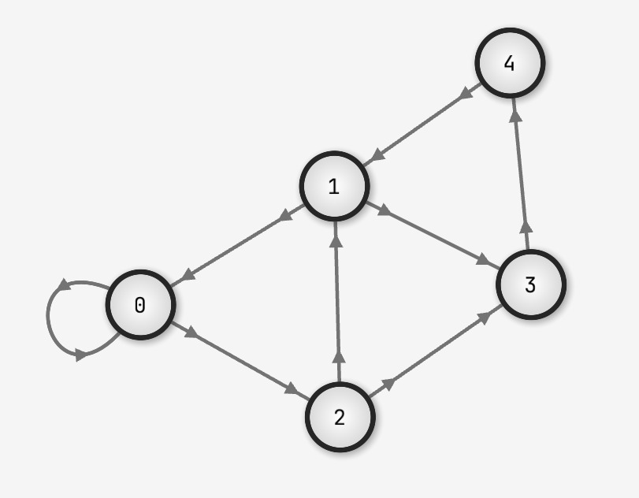

# Graph Networks

Niche functionality for a game engine, but SGE provides utilities for creating,
formatting and interacting with graph networks such as this:



You can create a network and customise it's behaviour like so:

```rust
let mut network = Network::new();
// allows the user to drag nodes around, more on how to use this later
network.allow_dragging = true; // default = false
// provides better automatic node positioning when using `.calc_positions_by_force`,
// at the cost of worse performance
network.use_expensive_algorithms = true; // default = false
// used for checking if a node is hovered or not, can be useful, more on this later
network.node_radius = 50.0; // default = 20.0

// you can add nodes in a few ways

// this will create the same layout as in the screenshot
// node 0 connects to node 0 and node 2
// node 1 connects to node 0 and node 3
// node 2 connects to node 1 and node 3
// et cetera, notice that links are directional
network.insert_nodes_with_links(&[&[0, 2], &[0, 3], &[1, 3], &[4], &[1]]);

// you can also insert a node onto the end with some connections
network.insert(vec![NodeId(2), NodeId(3)]);

// or onto a node directly
let node = NodeId(5);
node.add_connections(&mut network, &[NodeId(0)]);
```
