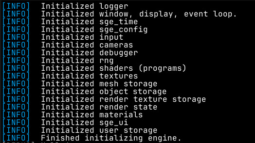

# Logging

SGE provides a [log](https://docs.rs/log/latest/log/) backend, that can be
optionally drawn to the screen and printed to stdout.

`draw_logs()` can be used to draw all the logs to the screen as rich text, when wanted.

Messages can be logged out using the included standard `log` macros. Shown in
descending order of importance:

- [`error!`](https://docs.rs/sge/latest/sge/prelude/logging/macro.error.html)
for logging out critical errors. Shown by default.
- [`warn!`](https://docs.rs/sge/latest/sge/prelude/logging/macro.warn.html) for
  logging out things that may be errors or indications of a bug, but do not stop
  the program from working. Shown by default.
- [`info!`](https://docs.rs/sge/latest/sge/prelude/logging/macro.info.html) for
logging out useful information. Shown by default.
- [`debug!`](https://docs.rs/sge/latest/sge/prelude/logging/macro.debug.html)
for logging out debug info messages. Not shown by default.
- [`trace!`](https://docs.rs/sge/latest/sge/prelude/logging/macro.trace.html) for
  logging out very minor information that could be useful for tracking down a
  bug. Not shown by default.
  
The minimum log level can be set with
[`set_min_log_level`](https://docs.rs/sge/latest/sge/prelude/logging/fn.set_min_log_level.html),
to show only logs equal to or more important than some log level, or disabled entirely.

The logger has multiple verbosity levels that can be configured
using [`set_logger_verbosity`](https://docs.rs/sge/latest/sge/prelude/logging/fn.set_logger_verbosity.html).

Logs will be printed to the terminal by default.

See: [logging module](https://docs.rs/sge/latest/sge/prelude/logging/index.html)
