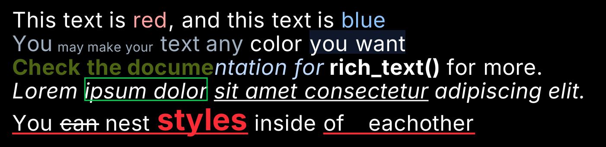

# Rich Text

Rich text supports rendering multiple styles, colors, sizes, and formatting modes inside a single text object.

You can construct rich text manually from `RichTextBlocks`, or parse it from a lightweight HTML-like syntax using `rich_text(str)`.

Parsing performs tokenization + style tree construction, so avoid reparsing every frame. Parse once and reuse the resulting `RichText`.

Quotes around argument values are optional as long as the value does not
contain spaces (e.g. #abc).

```html
<font size=50>
    This text is <font color=red3>red</font>,
    and this text is <font color=blue3>blue</font>

    <font color=#abc>
        You <font size=30>may make your</font> text any
    </font>

    <font color="rgb 1.0 1.0 1.0">
        color <hl color=slate9>you want</hl>
    </font>

    <font bold color="oklch 0.7 0.1184 119">
        Check the docume
    </font>
    <font italic color=blue2>
        ntation for
    </font>
    <b>rich_text()</b> for more.

    <i>
        Lorem <ol color=green5>ipsum dolor</ol>
        <ul>sit amet consectetur</ul>
        adipiscing elit.
    </i>

    <ul color=red5>
        You <st>can</st> nest
        <font color=red5 size=70 bold>styles</font>
        <noul>inside</noul>
        of eachother
    </ul>
</font>
```



Rich text can be drawn with `.draw` or `.draw_world`, and the text will be
wrapped within the area provided, and printed to stdout (the terminal), with
most of the formatting applied.

| Tag                                            | Information                                     | Supported arguements                                                   |
|------------------------------------------------|-------------------------------------------------|------------------------------------------------------------------------|
| &lt;b&gt; &lt;bold&gt; &lt;strong&gt;          | Makes the text inside of it                     | None                                                                   |
| &lt;i&gt; &lt;italic&gt; &lt;em&gt;            | Makes the text inside italic                    | None                                                                   |
| &lt;font&gt;                                   | More complex styling like font size             | size, color, bold, italic, underline, strikethrough, outline highlight |
| &lt;ul&gt; &lt;underline&gt;                   | Specifies an underline for text inside          | color                                                                  |
| &lt;st&gt; &lt;strikethrough&gt;               | Specifies strikethrough for text inside         | color                                                                  |
| &lt;nost&gt; &lt;no-strikethrough&gt;          | Removes strikethrough for text inside           | None                                                                   |
| &lt;hl&gt; &lt;highlight&gt; &lt;bg&gt;        | Specifies a background fill for the text inside | color                                                                  |
| &lt;nohl&gt; &lt;nobg&gt; &lt;no-highlight&gt; | Removes highlight for text inside               | None                                                                   |
| &lt;ol&gt; &lt;outline&gt;                     | Specifies an outline around the text inside     | color                                                                  |
| &lt;noul&gt; &lt;no-underline&gt;              | Removes underline for text inside               | None                                                                   |

Argument values can unquoted when the argument has no spaces.

```html
<font color=red5>
<font color="#abc">
<font color="rgb 1.0 1.0 1.0">
```

Rich text can also be printed to stdout with `.print_to_stdout()`, and will
retain most of the formatting in the terminal. If it looks weird, check if your
terminal supports true color.

Rich text is used by the logging system.

---
   
See: [`/examples/rich_text.rs`](https://github.com/LilyRL/sge/blob/master/examples/rich_text.rs)

See: [`rich_text`](https://docs.rs/sge/latest/sge/prelude/text/fn.rich_text.html).
