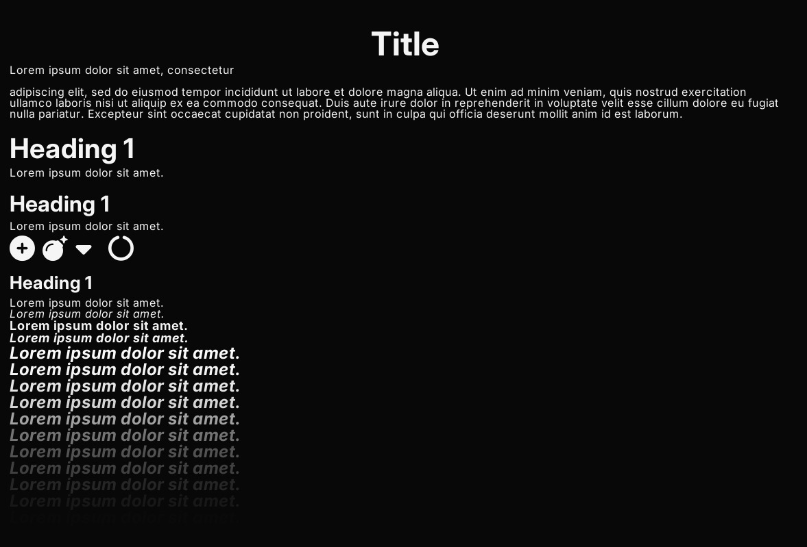

# Drawing text

There are 3 types of text drawing functions:
- `draw_text_*`: for basic text drawing. 
- `draw_multiline_text_*`: for properly drawing text with newlines in it.
- `draw_wrapped_text_*`: for drawing text with a max width, that wraps when it
   gets to the edge.

There are also equivalent functions for measuring the area text will take up
when drawn. These shouldn't be too slow as a cache is maintained internally.

There are functions for drawing text quickly, which only take the text and
position, and draw with the default monospaced font. You can use `draw_text_ex`
and `draw_text_custom` to specify the font used, text color, and more.

## Fonts

Fonts can be loaded with
[`create_ttf_font`](https://docs.rs/sge/latest/sge/prelude/text/fn.create_ttf_font.html).

SGE comes with [JetBrains Mono](https://www.jetbrains.com/lp/mono/) as it's
default font, and when the `extra_fonts` feature is enabled (by default), also 5
variants of the [Inter](https://rsms.me/inter/) typeface, for regular, bold,
italic, bold italic, and display. These are availible as the constants `MONO`,
`SANS`, `SANS_BOLD`, `SANS_ITALIC`, `SANS_BOLD_ITALIC`, and `SANS_DISPLAY`.

If you experience stuttering when drawing text, you can pre-populate the cache
of letters.

```rust
font_ref.populate_font_cache(&Font::latin_character_list(), 24);
```

You can also specify the filtering methods of the font texture.

```rust
font.use_linear_filtering(); 
font.use_nearest_filtering();
```

## Typeface

The `Typeface` struct groups fonts of the same typeface together so that they
can be used for things like rich text.



---
   
See:
[`/examples/text.rs`](https://github.com/LilyRL/sge/blob/master/examples/text.rs)
for an example

See: [text module
documentation](https://docs.rs/sge/latest/sge/prelude/text/index.html) for more detail.
