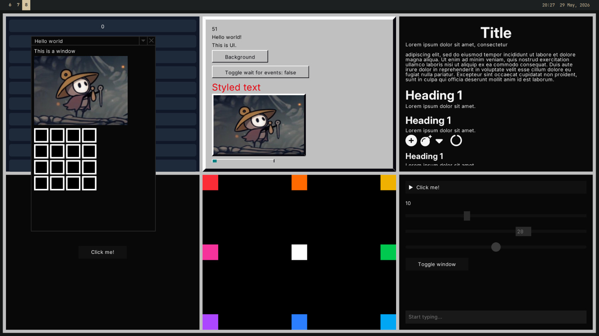

# UI

Finally... I've been waiting a long time to write this chapter. This is the #1
best part of the engine, no contest. THE USER INTERFACE LIBRARY!!!

The UI library is split into 2 sections. There is a library of `base` unstyled
elements that you can use to create more complex user interfaces of any style,
and a set of styles widgets from a few categories, at the moment there is `flat`
(the most comprehensive), `material` (meant to mimic Google Material UI 3;
supports theming), and `w95` (meant to mimic Windows 95, not really updated).

Complex layouts can be created by combining the basic `base`
components in a nested arrangement. The base components are designed to be as
simple as possible so as to be very flexible and be able to be used for many
different things by combining them with other elements. For example, instead of
a single `div` element like in HTML, there are smaller simpler elements for
adding a fill, adding a border, centering an element, adding padding, etc.

Base elements are designed to be as flexible as possible. For example, the
slider element allows you to create the bar and handle from other UI elements,
meaning you can have it look however you want. For an example of how this works,
check the [source code for the flat slider](https://docs.rs/sge_ui/1.1.4/src/sge_ui/library/flat/slider.rs.html#8)

The UI is immediate mode, which makes it much simpler to use, as you don't have
to tell the UI that some value has changed, you just pass in the true value
every frame and it updates instantly. Since the UI is rebuilt every frame, you
need some way of retaining state from one frame to the next, like the position
of a floating window, this is done by using unique IDs for UI elements. The
easiest way to do this is by using the `id!()` macro, which will give you a
unique but constant random number. You can see this being used around the UI
examples. If you need to create a derivative ID from an existing ID, for example
when creating a complex component that needs multiple stateful widgets, use
`original_id ^ id!()` (that's an XOR), to create a new unique ID that is based
on the original one.

> "The best way to learn about something is to see and use it for yourself" 
>
> -Sun Tzu

Thanks Sun, for this reason, I will point you to the `ui_showcase` example. If
you dont remember how to run examples, check the introduction chapter. This
example has a list of every UI element, and shows them in action. I would
reccomend you look through this with the code for the example open in another
window to see how everything is used. The source code is [here](https://github.com/LilyRL/sge/blob/master/examples/ui_showcase.rs).

Here's an awful looking screenshot from the `ui` example.



## Custom UI elements

You can create simple widgets from combinations of existing widgets, through a
function. All `library` widgets are created this way.

```rust
fn centered_black_text(text: impl ToString) -> UiRef {
    Center::new(Text::new_with_color(text, Color::BLACK))
}


fn card(bg: Color, child: Child) -> UiRef {
    Fit::new(BoxFill::new(bg, Padding::all(20.0, child)))
}
```

More complicated widgets may require you to express something not possible with
existing widgets. For more low level control, you can create a struct that
implements the `UiNode` trait. For example, here is a simplified version of the
`Center` node.

```rust
// note that all UI nodes must implement Debug
#[derive(Debug)]
pub struct Center {
    child: Child
}

impl Center {
    pub fn new(child: Child) -> UiRef {
        // to ref converts an implementer of UiNode to a generic reference
        // that can be used inside of other nodes
        Self { child }.to_ref()
    }
}

impl UiNode for Center {
    fn preferred_dimensions(&self) -> Vec2 {
        // means it will take up the maximum space it can inside of a container
        Vec2::INFINITY
    }

    fn size(&self, area: Area) -> Vec2 {
        // uses up the entire area and puts the child in the center
        area.size
    }

    fn draw(&self, mut area: Area, ui: &UiState) -> Vec2 {
        let inner = self.child.node.size(area);
        let diff = (area.size - inner).max(Vec2::ZERO);
        area.top_left += diff / 2.0;

        // if it's a container make sure to actually draw the child/children
        self.child.node.draw(area, ui);

        // we return the amount of space we used up
        // this should always be the same as self.size(),
        // but saves computing it twice in the case of something with complex
        // layout work to do
        area.size
    }
}
```

If you're creating something more complex still, like some sort of input
element, you may need to have some internal mutable state for that UI element.
There is a builtin helper for this, the `State` struct, which stores state from
a constant ID.

```rust
#[derive(Debug)]
pub struct TextInput {
    state: State<InputState>,
}

#[derive(Default, Debug)]
pub struct InputState {
    value: String,
}

impl TextInput {
    pub fn new(
        id: usize,
    ) -> UiRef {
        let state = State::from_id(id);
        TextInput { state }.to_ref()
    }
}

impl UiNode for TextInput {
    // ...
    
    fn draw(&self, area: Area, ui: &UiState) -> Vec2 {
        let state = self.state.get_or_default();
        // or: self.state.get_or_create_mut(|| InputState { value: String::new() });
        
        // now you have a mutable reference to a persistent state object for this ui element
    }
}
```

---

See: [ui module](https://docs.rs/sge/latest/sge/prelude/ui/index.html)
